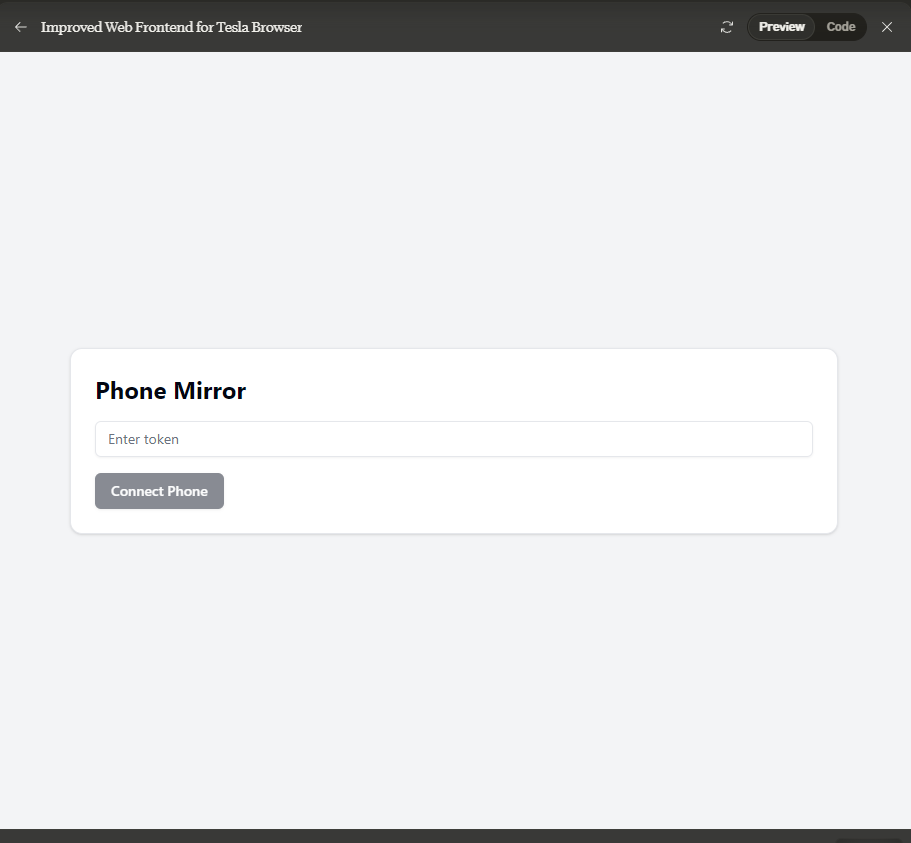

# Tesla Browser Phone Screen Mirroring System

This project enables mirroring of Android and iPhone screens to a Tesla browser. It consists of four main components:

1. Android App
2. iPhone App
3. Backend Server
4. Web Frontend (for Tesla Browser or other)


## 1. Android App

### Installation

1. Open the project in Android Studio.
2. Ensure you have the latest Android SDK installed.
3. Connect your Android device or use an emulator.
4. Build and run the app on your device/emulator.

### Configuration

1. Open `ScreenMirrorActivity.kt`.
2. Replace `"ws://your-server-url:3001"` with your actual WebSocket server URL.
3. Update the `JWT_SECRET` in the app to match your server's secret.

### Usage

1. Launch the app on your Android device.
2. Tap "Start Mirroring" to begin screen mirroring.
3. Tap "Stop Mirroring" to end the session.

## 2. iPhone App

### Installation

1. Open the project in Xcode.
2. Ensure you have the latest Xcode version and iOS SDK installed.
3. Connect your iPhone device (required for screen recording capabilities).
4. Build and run the app on your device.

### Configuration

1. Open `ScreenMirrorViewController.swift`.
2. Replace `"ws://your-server-url:3001"` with your actual WebSocket server URL.
3. Update the `Info.plist` file with necessary permissions:

```xml
NSCameraUsageDescription
This app needs camera access to record the screen.
NSMicrophoneUsageDescription
This app needs microphone access to record the screen.
```

### Usage

1. Launch the app on your iPhone.
2. Tap "Start Mirroring" to begin screen mirroring.
3. Tap "Stop Mirroring" to end the session.

## 3. Backend Server

### Installation

1. Ensure you have Node.js and npm installed.
2. Navigate to the server directory.
3. Run `npm install` to install dependencies.

### Configuration

1. Create a `.env` file in the server directory with the following content:

```
JWT_SECRET=your_secret_key
DATABASE_URL=your_database_connection_string
PORT=3001
```

2. Replace `your_secret_key` with a secure random string.
3. Replace `your_database_connection_string` with your PostgreSQL database URL.

### Usage

1. Run `npm start` to start the server.
2. The server will be available at `http://localhost:3001` (or the port you specified).

## 4. Web Frontend (for Tesla Browser)

### Installation

1. Ensure you have Node.js and npm installed.
2. Navigate to the web frontend directory.
3. Run `npm install` to install dependencies.

### Configuration

1. Open `PhoneMirror.js`.
2. Replace `"ws://your-server-url:3001"` with your actual WebSocket server URL.

### Usage

1. Run `npm start` to start the development server.
2. Access the web app through the Tesla browser at the provided URL.

## Additional Notes

- Ensure all components are on the same network or that the server is accessible to both the mobile apps and the Tesla browser.
- The JWT secret must be the same across the server and mobile apps for authentication to work correctly.
- For production use, implement proper error handling, reconnection logic, and security measures.
- Remember to comply with all relevant laws and regulations regarding screen recording and data transmission.

## Troubleshooting

- If the connection fails, check that the WebSocket URL is correct and that the server is running.
- For iPhone app issues, ensure you're testing on a physical device, not the simulator.
- If authentication fails, verify that the JWT secret is consistent across all components.

## Security Considerations

- Use HTTPS for the web frontend and WSS (WebSocket Secure) for real-time communications.
- Regularly update the JWT secret and implement token refresh mechanisms.
- Implement rate limiting and other anti-abuse measures on the server.

For any additional help or feature requests, please open an issue in the project repository.

